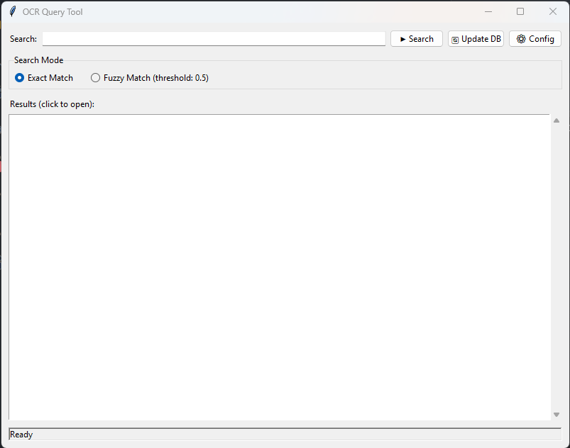
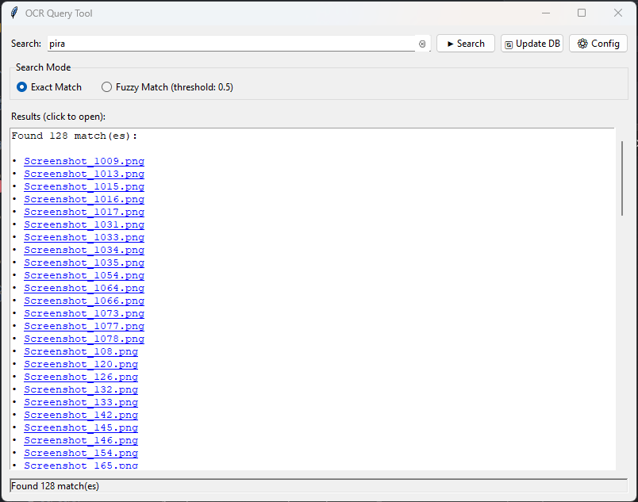

# POCR 2


An Optical Character Recognition (OCR) tool to recognize, save, and query data from a folder full of images with lots of text. Use cases are folders with documents, recipes, or screenshots you made to remember things.

So boost privacy and avoid sending your images to third-party services, it runs locally on your machine. It's fast, multi-platform, and multi-threaded.




## Features

- Image text extraction from multiple image formats (PNG, JPG, BMP, etc.)
- Local processing for enhanced privacy
- Powered by tesseract OCR engine
- Dead-simple GUI and CLI interfaces
- Multi-threaded for performance

## Requirements

- Python 3.10 and above. Tested on Python 3.10, 3.11, 3.12, and 3.13.
- Additional dependencies in `requirements.txt`

## Installation

1. Clone the repository or [download the source code](https://github.com/pirafrank/pocr2/archive/refs/heads/main.zip).

2. Setup a virtual environment and install dependencies via `just`:

```bash
just prepare
just setup
```

or manually:

```bash
python -m pip install virtualenv
python -m virtualenv .venv
source .venv/bin/activate  # On Windows use `.venv\Scripts\activate.ps1`
pip install -r requirements.txt
```

## Configuration

Configuration is managed via the `config.toml` file in known locations. See `config.example.toml` for reference.

## Usage

Usage is managed via `just` commands to make it simple. Check the `justfile` file for more details or to know how to run the scripts manually.

### GUI

```
just run
```

### CLI

Run OCR processing in configured folder to init or update database:

```
just process
```

Query the database for text:

```
just search
```

## About the name

POCR stands for "Python OCR". The "2" because this is the second iteration. The first one was based on Visual LLMs out of curiosity, but proved too cumbersome to run and use. Not every problem needs an LLM solution.

## License

See LICENSE file for details.

## Contributing

Contributions are welcome. Please open an issue or submit a pull request.

## Disclaimer

This project is provided "as is" without any warranties. Use at your own risk.
