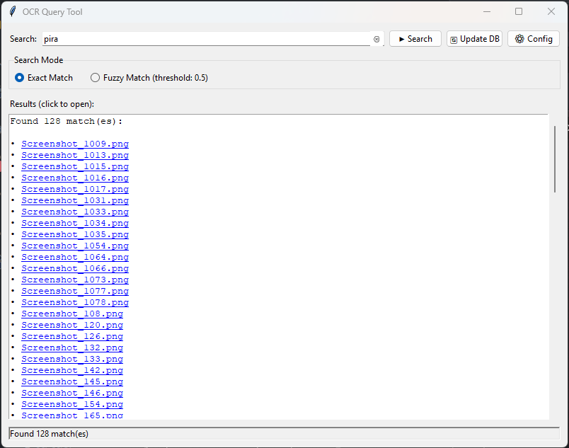

# POCR 2


A smart and privacy-focused Optical Character Recognition (OCR) tool to recognize, save, and query data from a folder full of images with lots of text. It runs locally and is fast, multi-platform, and multi-threaded.

Born as a personal tool. Not meant to be famous.



## Use cases

- folders with documents and recipes
- work environments and workflows where sending images to third-party services is not allowed
- you make screenshots during calls to remember things

## Features

- Image text extraction from multiple image formats (PNG, JPG, BMP, etc.)
- Local processing for enhanced privacy
- OCR engine selection: choose `tesseract` for CPU computation or `ollama` for AI-powered OCR via models provided by [Ollama](https://ollama.com/)
- Multi-threaded for performance
- Optional custom database path via config
- Simple GUI and CLI interfaces

## Requirements

- Python 3.10 and above. Tested on Python 3.10, 3.11, 3.12, and 3.13.
- Dependencies are managed in `pyproject.toml`.

## Installation

1. Clone the repository or [download the source code](https://github.com/pirafrank/pocr2/archive/refs/heads/main.zip).

2. Install it

```bash
pip install .
```

or via `uv`:

```bash
uv pip install .
```

## Installation (Development)

1. Clone the repository or [download the source code](https://github.com/pirafrank/pocr2/archive/refs/heads/main.zip).

2. Setup a virtual environment and install dependencies via `just`:

```bash
just prepare
just setup
```

or manually:

```bash
python -m pip install virtualenv
python -m virtualenv .venv
source .venv/bin/activate  # On Windows use `.venv\Scripts\activate.ps1`
pip install -e .
```

## Configuration

Configuration is managed via the `config.toml` file in known locations. See `config.toml.example` for reference.

You can also provide a custom config file path at runtime:

```bash
pocr2 index --config C:/path/to/config.toml
```

If `--config` is not provided, POCR2 uses the default known config locations.

Key options in `config.toml`:

- `screenshots_dir`: directory with images to index.
- `db_path` (optional): custom SQLite path. If omitted, POCR2 uses the default data directory.
- `ocr_engine`: choose `tesseract` or `ollama`.
- `ollama_host`, `ollama_model`, `ollama_prompt`: used when `ocr_engine = "ollama"`.
- `max_workers`: OCR parallelism.
- `fuzzy_threshold`: default threshold for fuzzy search.

## Usage

POCR2 uses a unified entrypoint:

```bash
pocr2 <command> [--config C:/path/to/config.toml]
```

Commands:
- `index` runs OCR processing and updates the database.
- `search` runs CLI search mode.
- `--gui` launches the graphical interface.

Examples:

```bash
pocr2 index
pocr2 search
pocr2 --gui
pocr2 index --config C:/path/to/config.toml
```

`just` commands are still available for convenience. Check `justfile` for details.

Alternative module invocation (without script wrapper):

```bash
python -m src.main index
```

### GUI

```
just run
```

### CLI

Run OCR processing in configured folder to init or update database:

```
just process
```

Query the database for text:

```
just search
```

## Documentation

- [Code architecture](docs/architecture.md)
- [Tesseract vs Ollama OCR](docs/ocr-comparison.md), including GPU usage context and screenshots.

## About the name

POCR stands for "Python OCR". The "2" because this is the second iteration. The first one was based on Visual LLMs out of curiosity, but proved too cumbersome to run and use. Not every problem needs an LLM solution.

## License

See LICENSE file for details.

## Contributing

Contributions are welcome. Please open an issue or submit a pull request.

## Disclaimer

This project is provided "as is" without any warranties. Use at your own risk.
