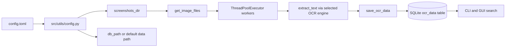

# POCR2 Architecture

POCR2 is organized around a single entrypoint (`pocr2`) and three execution paths: indexing (`index`), search (`search`), and GUI (`--gui`).

## Component Overview

Entrypoint:

- `src/main.py` is the entrypoint and routes execution to indexing (`index`), search (`search`), or GUI (`--gui`).

Main scripts:

- `src/index.py` drives OCR indexing and depends on:
  - `src/utils/config.py`,
  - `src/utils/ocr_processor.py`,
  - `src/db/database.py`.
- `src/cli.py` handles command-line search by using `src/query.py` and `src/db/database.py`.
- `src/gui.py` provides a graphical interface, alternative to the CLI mode

Modules:

- `src/query.py` contains exact and fuzzy matching logic used by CLI and GUI.
- `src/db/database.py` is the shared persistence layer used during indexing and searching.
- `src/utils/config.py` provides runtime configuration values consumed across index and GUI paths.

## Runtime Data Flow (Indexing)

## Module Responsibilities

- `src/main.py`: argument parsing and mode dispatch (`index`, `search`, `--gui`), plus optional `--config` override.
- `src/index.py`: indexing orchestration; loads config, initializes `OCRProcessor`, writes OCR output to SQLite.
- `src/utils/ocr_processor.py`: image discovery and parallel OCR. Supports `tesseract` and `ollama`.
- `src/db/database.py`: thread-safe SQLite access with thread-local connections and guarded inserts.
- `src/query.py`: exact search (SQLite LIKE) and fuzzy search (Levenshtein ratio in Python).
- `src/cli.py`: interactive command-line search UI.
- `src/gui.py`: Tkinter app for search and indexing, including quick actions to open config and screenshots folder.
- `src/utils/config.py`: platform-aware config/data paths, config loading with defaults, runtime override support.

## Concurrency and Safety Notes

- Indexing uses `ThreadPoolExecutor` to process files concurrently.
- Database writes are synchronized via a lock in `OCRDatabase.save_ocr_data`.
- Connections are thread-local (`threading.local()`), avoiding shared cursor/connection state across worker threads.

## Configuration Model

- Configuration file location is platform-aware:
  - Windows: `%APPDATA%/pirafrank/pocr2/config/config.toml`
  - Linux/macOS: `$XDG_CONFIG_HOME/pirafrank/pocr2/config/config.toml` or `~/.config/...`
- Data directory is also platform-aware (`LOCALAPPDATA` on Windows, `XDG_DATA_HOME` or `~/.local/share` on Linux/macOS).
- `db_path` can override the default SQLite location; relative paths are resolved from current working directory.
