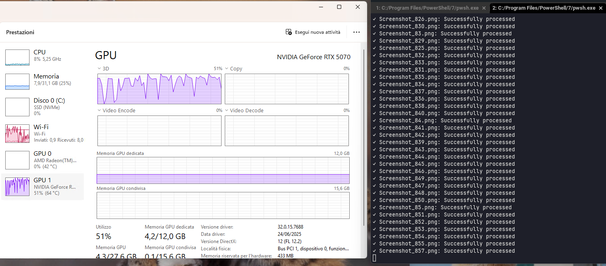
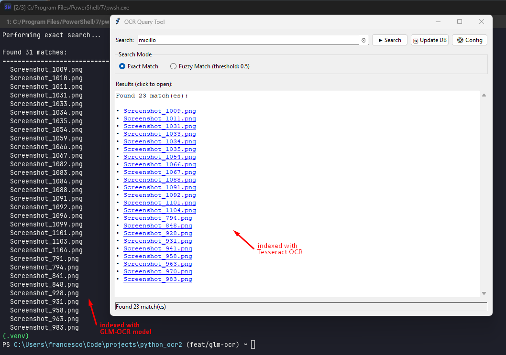

# Tesseract vs Ollama OCR

POCR2 supports two OCR backends selected by `ocr_engine` in `config.toml`:

- `tesseract`
- `ollama` (through an Ollama server)

Note: `ollama` is the engine keyword. The model itself is configured separately via `ollama_model` (for example `glm-ocr`).

This comparison is based on how POCR2 integrates each engine today, plus practical expectations. There are no built-in benchmark scripts in this repository.

## About Ollama, vision models, and GPU workloads

- Ollama GPU behavior and compatibility details:
  - <https://docs.ollama.com/gpu>
  - <https://docs.ollama.com/faq>
- Ollama vision/image-input behavior and GLM-OCR model details:
  - <https://docs.ollama.com/capabilities/vision>
  - <https://ollama.com/library/glm-ocr>
  - <https://docs.z.ai/guides/vlm/glm-ocr>

## Quick Comparison in the code

| Aspect | Tesseract (`pytesseract`) | Ollama OCR (`ollama`) |
| --- | --- | --- |
| Integration in code | `pytesseract.image_to_string(image)` | `ollama.Client(...).chat(..., images=[image_path])` |
| Runtime dependency | Local Tesseract executable | Running Ollama server + pulled model |
| Config keys used | `tesseract_path` | `ollama_host`, `ollama_model`, `ollama_prompt` |
| Default in project | Yes (`ocr_engine = "tesseract"`) | Optional (`ocr_engine = "ollama"`) |
| Failure handling in POCR2 | Returns empty string on OCR errors | Returns empty string on request/model errors |

## Why GLM-OCR?

Because it is lightweight and, as of early 2026, achieves state-of-the-art performance for a model having 0.9B parameters. It's powerful enought to achive a score of 94.62 on OmniDocBench V1.5 while being small enough to fit in most VRAM GPU. It topped the OmniDocBench V1.5 benchmark demonstrating exceptional performance in text recognition, formula recognition, table parsing, and information extraction.

## GPU usage with Ollama (`ocr_engine = "ollama"`)

- Ollama can run models on GPU, CPU, or mixed CPU/GPU memory depending on hardware support and available VRAM (<https://docs.ollama.com/faq>, <https://docs.ollama.com/gpu>).
- You can verify actual placement with `ollama ps`:
  - `100% GPU` means fully loaded on GPU.
  - `100% CPU` means system-memory-only.
  - split values like `48%/52% CPU/GPU` mean partial offload (<https://docs.ollama.com/faq>).
- In multi-GPU setups, Ollama first tries to fit a model on one GPU; if it cannot fit, it can spread across GPUs (<https://docs.ollama.com/faq>).
- GPU selection and forcing behavior can be controlled with env vars such as `CUDA_VISIBLE_DEVICES` (NVIDIA) and `ROCR_VISIBLE_DEVICES` (AMD) (<https://docs.ollama.com/gpu>).
- GLM-OCR in Ollama is a vision model that accepts text + image input, so GPU usage reflects general Ollama inference behavior plus model size/context constraints (<https://docs.ollama.com/capabilities/vision>, <https://ollama.com/library/glm-ocr>). It is small enough to run entirely in VRAM (image below).

## Practical Trade-offs

- Setup simplicity: Tesseract is usually simpler once the binary is installed and `tesseract_path` is correct.
- Environment requirements: Ollama OCR needs an accessible Ollama endpoint and the selected model available on that endpoint.
- Throughput expectations: local Tesseract is typically lighter; Ollama OCR adds model inference overhead and can be slower depending on hardware/model size.
- Text coverage: in complex documents (tables, mixed layouts, noisy scans), VLM-based OCR may recover more usable text than Tesseract, but this is workload-dependent (more below).
- Output style: Ollama OCR uses a prompt (`ollama_prompt`) and can produce markdown-oriented output, while Tesseract returns plain OCR text (albeit this is a thing only if you edit the code. I perform text extraction for an easy save to SQLite DB).
- Privacy model: both are local-first in POCR2 when services run on your own machine.

## Technical Details in current implementation

- Engine selection happens in `src/utils/ocr_processor.py`:
  - `OCRProcessor.extract_text()` dispatches to `_extract_text_tesseract()` or `_extract_text_ollama()`.
- Tesseract path wiring:
  - `pytesseract.pytesseract.tesseract_cmd = tesseract_path`
- Ollama OCR wiring:
  - `self.ollama_client = ollama.Client(host=self.ollama_host)`
  - `chat()` call sends both prompt text and image path.
- Indexing flow (`src/index.py`) passes engine and model settings into `OCRProcessor` from config.

## Tesseract GPU reality check

**tl;dr** Usually, a Tesseract install performs OCR using only the CPU.

- Tesseract has OpenCL support, but the project documents it as experimental with major bugs; it is not the default stable path for most users (<https://tesseract-ocr.github.io/tessdoc/TesseractOpenCL.html>, <https://github.com/tesseract-ocr/tesseract/wiki/TesseractOpenCL/5e12b82da134fe854178611e940354b7a3ce336f>).
- The docs also state only parts of OCR are handled by OpenCL, so GPU enablement does not guarantee major speedups.

## VLM vs traditional OCR

VLM-based OCR may recover more usable text than Tesseract on complex documents (tables, mixed layouts, noisy scans), with a clear caveat that it depends on your hardware.

The image below shows that. Read it as a field comparison. It is not a universal benchmark result, YMMV. Performance/quality depend on document type, image quality, model choice, and hardware. And in case of screenshots like below, the screen resolution.

But this is not always a guarantee!

VLM-based OCR is not always superior. Traditional OCR tools like Tesseract remain highly effective—and often preferable—for clean, well-formatted printed documents, where Tesseract can achieve 95% or higher accuracy with significantly lower computational overhead.

## When to Choose Which

So, *What I should use?* you may ask. Well, performance of one or the other solution depends on image characteristics.

- Choose `tesseract` when your screenshots are usually clearly readable and you want the simplest local setup and predictable baseline OCR behavior. Also, when you are running on old hardware or have a GPU with < 4GB VRAM.
- Choose `ollama` when your screeshots are complex, you have a dedicated GPU with enought memory, or when you want prompt-driven extraction behavior and are already running Ollama with a compatible vision model. You can always choose the model that fits your needs best. AI moves fast and GLM-OCR may get old soon.
